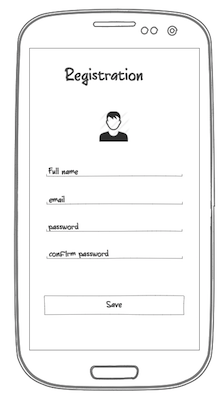
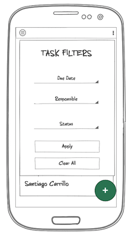

<h1 align="center">1.4 Task Planner Project - Front End - Part 2</h1>

[](https://www.npmjs.com/)
[](https://www.npmjs.com/package/npx)
[](https://material-ui.com/)
[](https://reacttraining.com/react-router/)
[](https://www.heroku.com/)


1. Open the project created on Part 1.

2. Create the NewTask.js component and the corresponding CSS file if needed (use the Material-UI library!).


3. Modify the App.js component so that it uses [BrowserRouter](https://reacttraining.com/react-router/web/example/basic) to enable the navigation from a "+" [floating action button](https://material-ui.com/components/floating-action-button/) in the main view to take the user to the *NewTask* component.

4. Implement the logic to be able to connect the main view so that the new task is added to the list on the main view when the user clicks the add button.

Remember the model to represent a task:
  ```javascript
       {
    	"description": "some description text ",
    	"responsible": {
    		"name": "Santiago Carrillo",
    		"email": "sancarbar@gmail"
    	},
    	"status": "ready",
    	"dueDate": 156464645646
    }
```
5. Implement the UserProfile.js component to update the user profile details (make sure this updates your navigationDrawer in your main view):



6. Create a [Modal](https://material-ui.com/utils/modal/) to display the options for filtering the list of tasks.



7. Implement the logic so that the data is filtered according to the applied filters.
